KyotoTrip
==========================

KyotoTrip is iOS app for Visitors. 

- __App Store__: <https://apps.apple.com/jp/app/kyoto-trip/id1516721339>

Source Code
--------------------------

### Development Environment

- Xcode 12.2

How to Build
--------------------------

1. Run following commands to resolve dependencies.
    - `pod install`
1. Open `KyotoTrip.xcworkspace` in Xcode.
1. Build "KyotoTrip" scheme in the workspace.

## License

KyotoTrip is released under the MIT License.
